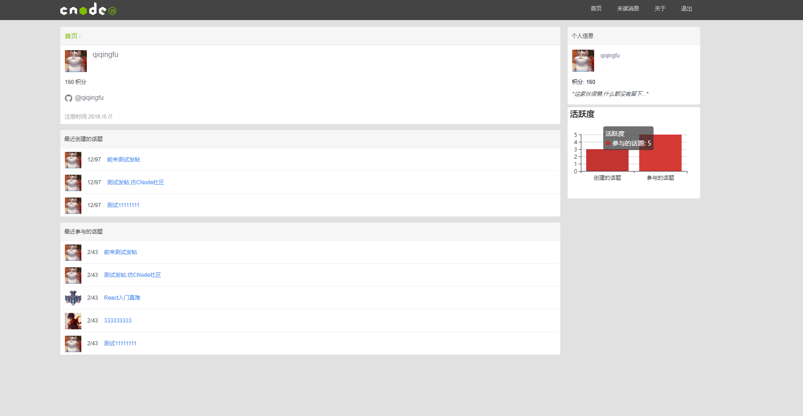
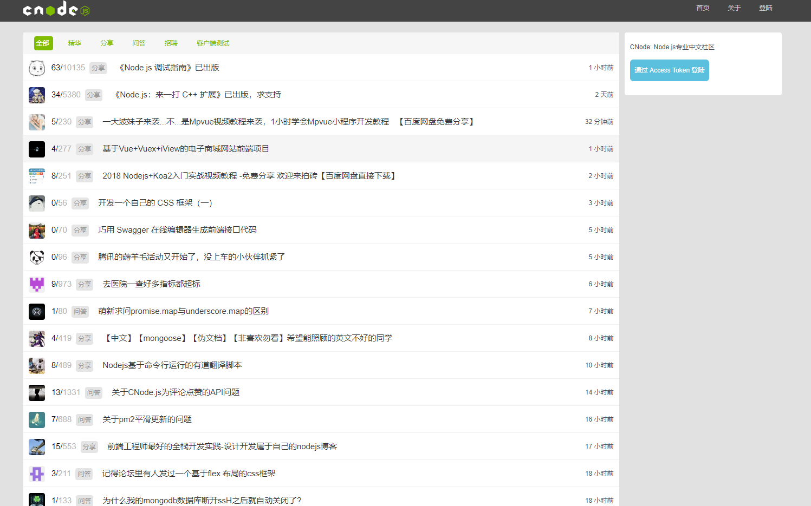
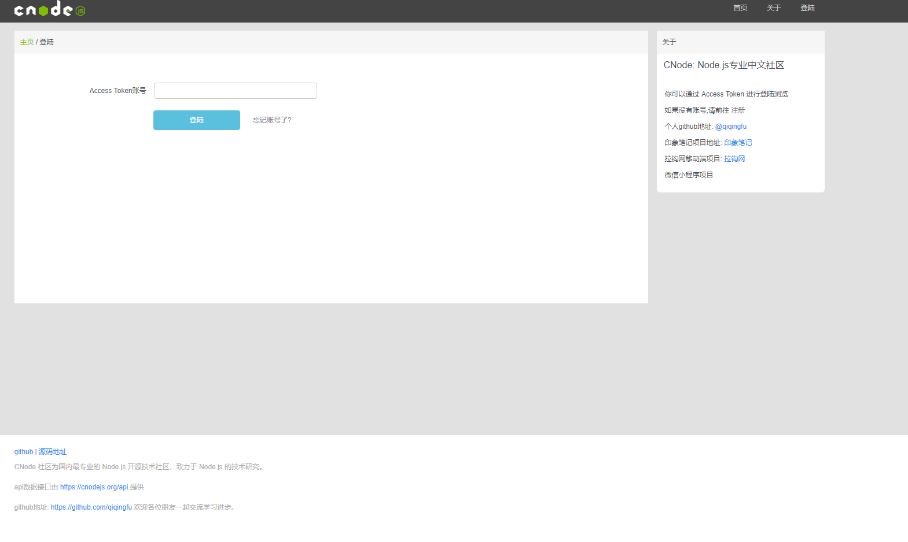
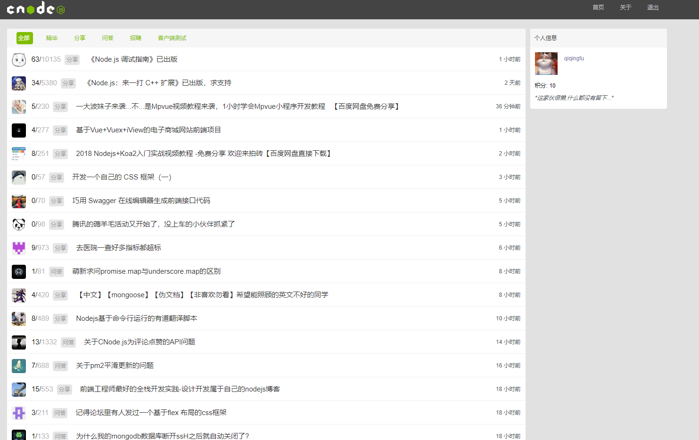
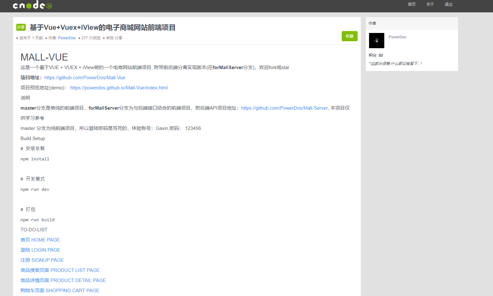
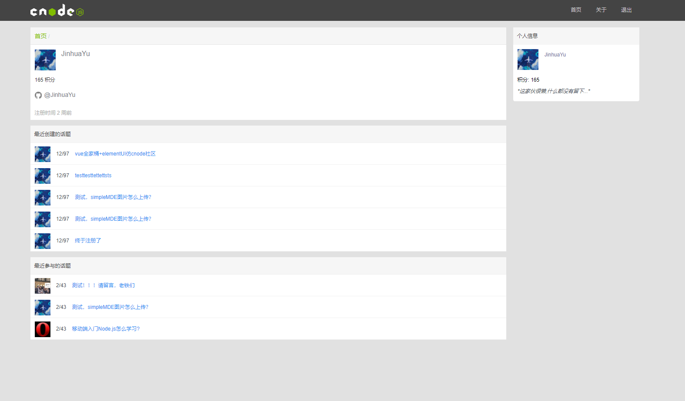
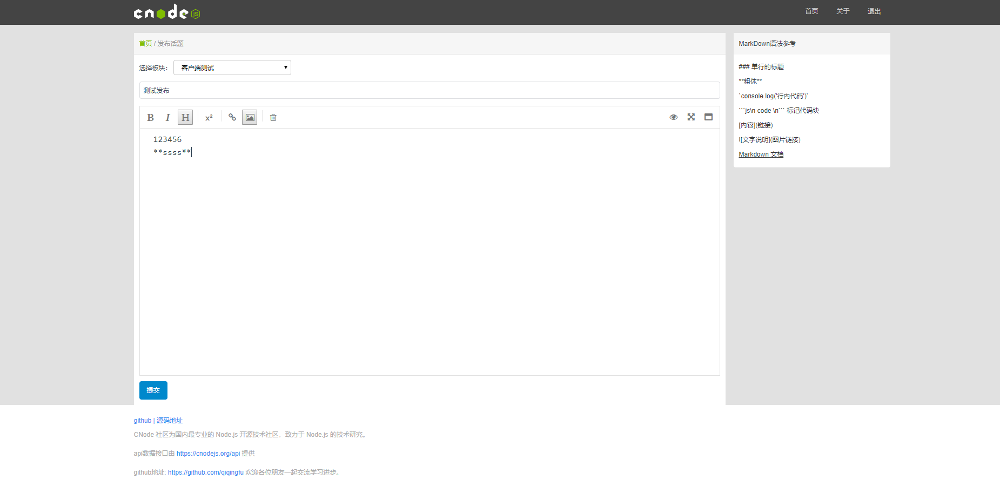
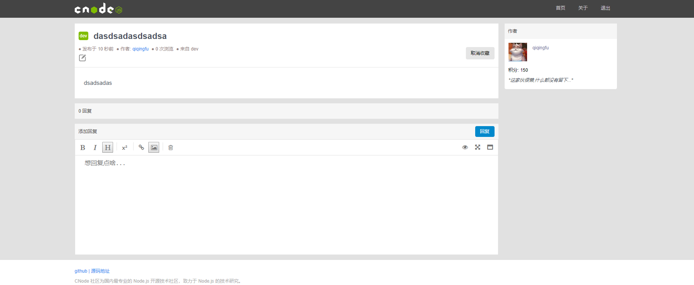

### 基于Vue开发的Cnode社区

#### 终端 pc

[遇到的问题及解决](https://github.com/qiqingfu/Vue-https-cnodejs.org/issues)

- [x] 用户登陆
- [x] 收藏主题
- [x] 取消收藏
- [x] 给评论点赞
- [x] @其他用户回复
- [x] 添加回复
- [x] 新建模块
- [x] 编辑模块
- [x] 查看其他用户信息
- [ ] 未读消息
- [ ] 过往消息

##### 部分预览图

